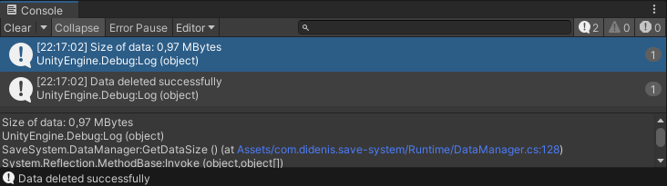

# Save System

## Setup

1. Click on the green button "Code"


2. Then click on copy button, in "HTTPS" tab


3. In Unity open the Package Manager window (Window/Package Manager)


4. Then click on plus sign and select "Add package from git URL"


5. Insert copied link and click on "Add"


6. After sometime this package will be add to your project


## How to use

[DataManager](Runtime/DataManager.cs) is the main class
for managing data. To save and load your
objects, they must implement the
[IPersistentObject](Runtime/IPersistentObject.cs.meta)
interface.

````csharp
public class YourClass : IPersistentObject {

    public string name;
    public bool isDestroy;
    public float health;
    
    
    public void Save (UnityWriter writer) {
        writer.Write(name);
        writer.Write(isDestroy);
        writer.Write(health);
    }
    
    
    public void Load (UnityReader reader) {
        name = reader.ReadString();
        isDestroy = reader.ReadBool();
        health = reader.ReadFloat();
    }
    
}
````

> You must read data in the same order as you write it.

Also you can write and read data such as
Vector3, Quaternion, Color and your custom
classes and structs

````csharp
public void Save (UnityWriter writer) {
    writer.Write(transform.position);
    writer.Write(transform.rotation);
    
    writer.Write(material.color);
    
    writer.Write(myObject);
    writer.Write(myObjects);
}


public void Load (UnityReader reader) {
    transform.position = reader.ReadPosition();
    transform.rotation = reader.ReadRotation();
    
    material.color = reader.ReadColor();
    
    myObject = reader.ReadObject<MyObject>();
    myObjects = reader.ReadArrayObjects<MyObject>();
}
````

Your classes should not inherits from MonoBehaviour because
MonoBehaviour classes cannot be created from a constructor.
Instead, implement the IPersistentObject interface on them
and save them using the SaveObject method. Same
for loading

To save your objects usually you would write

````csharp
DataManager.SaveObject(fileName, this);
// or
DataManager.SaveObjects(fileName, new IPersistentObject[] {this, otherObject});
````

To load you can write

````csharp
if (DataManager.LoadObject(fileName, this)) {
    // some actions
}
````

LoadObject method returns true if it successfully
loaded your object. If there is no safe file,
the method will return false.

### Other

In unity editor there is button for remove data


It is active only when there is data. After you remove
the data, this button will be disabled.

Also Data Manager menu contains Get Data Size
button. It writing size of your data files in debug
console

