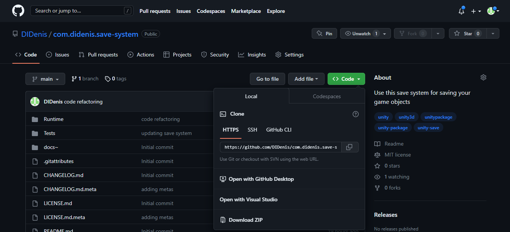
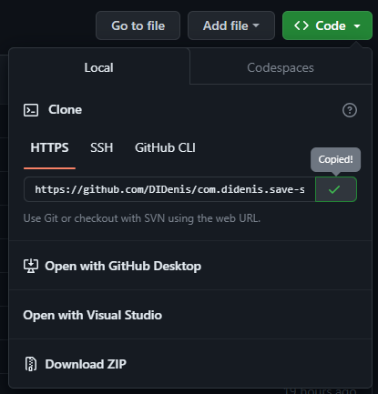
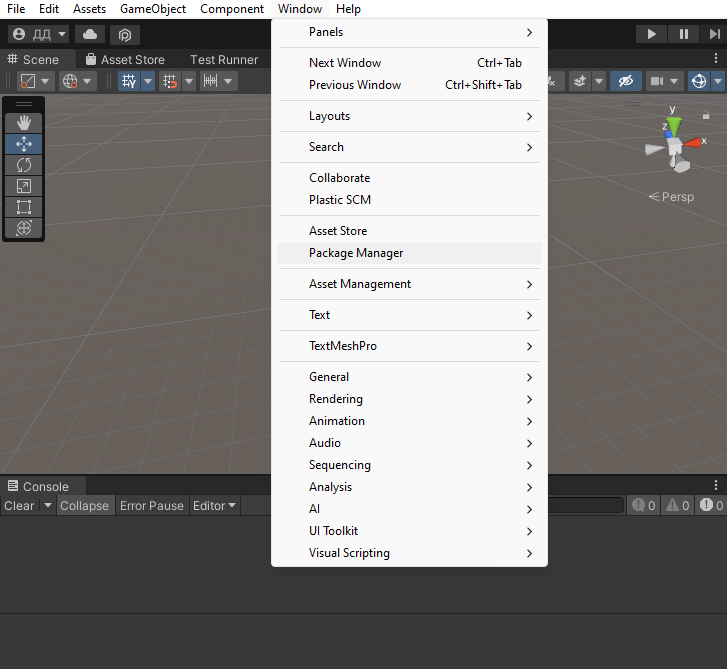
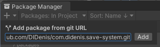
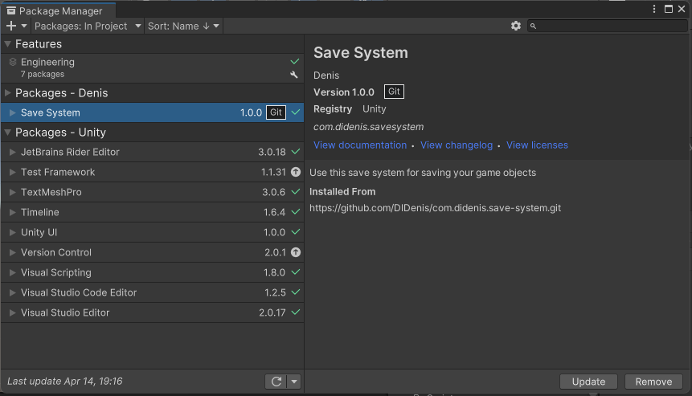
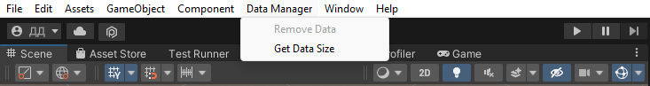

# Save System

## Setup

1. Click on the green button "Code"



2. Then click on copy button, in "HTTPS" tab



3. In Unity open the Package Manager window (Window/Package Manager)



4. Then click on plus sign and select "Add package from git URL"


5. Insert copied link and click on "Add"



6. After sometime this package will be add to your project



## How to use

[DataManager](Runtime/DataManager.cs) is main class
for managing data. For saving and loading your
objects, its must implements
[IPersistentObject](Runtime/IPersistentObject.cs.meta)
interface.

````csharp
public class YourClass : IPersistentObject {

    public string name;
    public bool isDestroy;
    public float health;
    
    
    public void Save (UnityWriter writer) {
        writer.Write(name);
        writer.Write(isDestroy);
        writer.Write(health);
    }
    
    
    public void Load (UnityReader reader) {
        name = reader.ReadString();
        isDestroy = reader.ReadBool();
        health = reader.ReadFloat();
    }
    
}
````

You must reading data in the same order 
as you writing their. 

Also you can writing and reading data such as 
Vector3, Quaternion, Color and your custom 
classes and structs

````csharp
public void Save (UnityWriter writer) {
    writer.Write(transform.position);
    writer.Write(transform.rotation);
    
    writer.Write(material.color);
    
    writer.Write(myObject);
    writer.Write(myObjects);
}


public void Load (UnityReader reader) {
    transform.position = reader.ReadPosition();
    transform.rotation = reader.ReadRotation();
    
    material.color = reader.ReadColor();
    
    myObject = reader.ReadObject<MyObject>();
    myObjects = reader.ReadArrayObjects<MyObject>();
}
````

For writing and reading your classes should not be
inherited from MonoBehaviour, because MonoBehaviour
classes can't be created from constructor.

For saving your objects usually you will write

````csharp
DataManager.SaveObject(fileName, this);
// or
DataManager.SaveObjects(fileName, new IPersistentObject[] {this, otherObject});
````

For loading you can writing

````csharp
if (DataManager.LoadObject(fileName, this)) {
    // some actions
}
````

LoadObject method returns true when he loading your
object successfully. If save file doesn't exists,
method will has return false.

In unity editor there is button for remove data



It active only when data is exist. After you remove
data, this button will have disabled